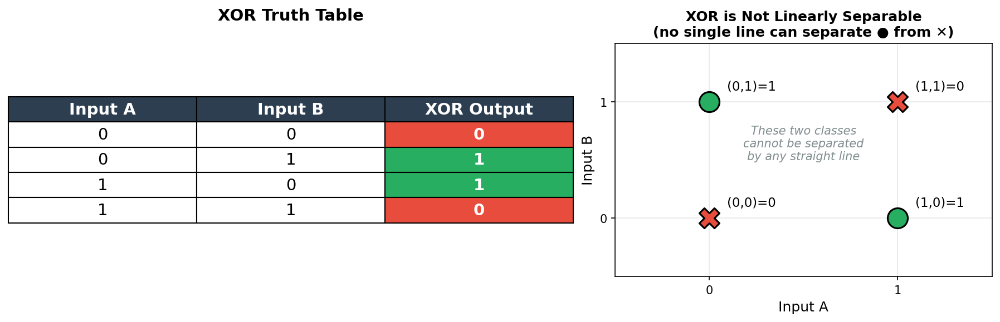
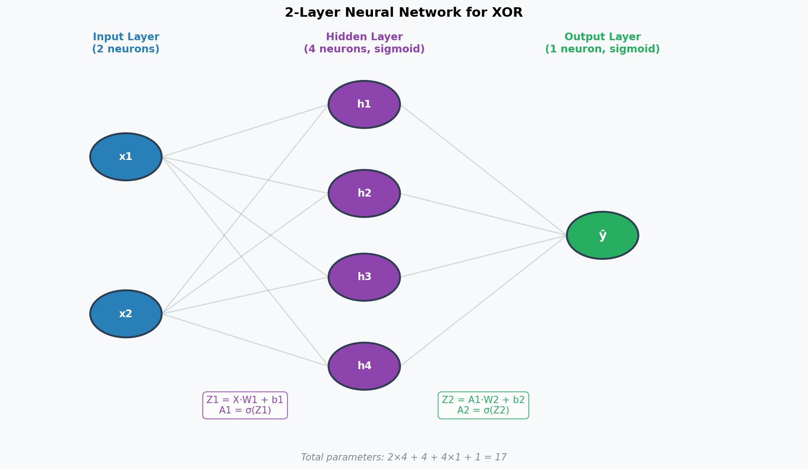

# Neural Net & Backprop From Scratch
## What this repo about
Designing a neural net solution to learn from data to solve the XOR problem

## Why XOR
XOR is a non-linear operation so simple linear classifier models won't work well. Neural Nets can learn from non-linear data and perform well


## Network Architecture



**bold text**
*italic text*

`inline code`

​```python
code block
​```
