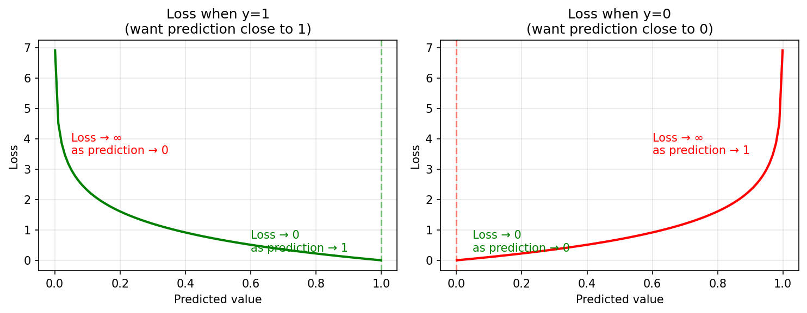
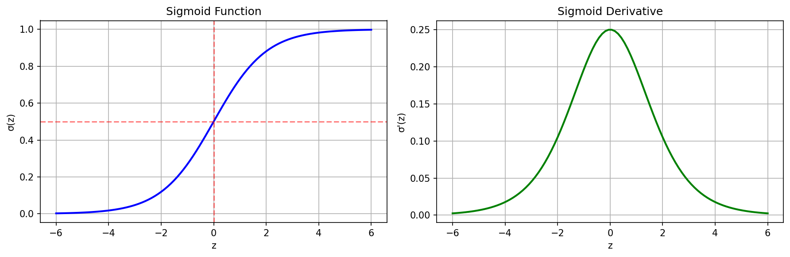
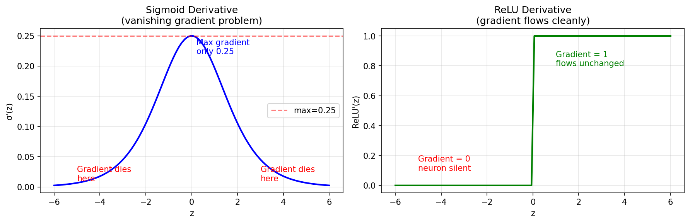
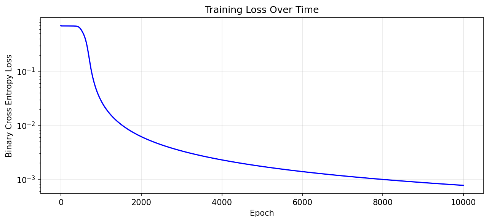

# Neural Net & Backprop From Scratch
## What this repo about
Designing a neural net solution to learn from data to solve the XOR problem. Built as a deliberate learning exercise to revisit neural nets and backpropagation after years of training neural networks in production

## Why XOR

XOR is a non-linear operation so simple linear classifier models won't work well. Neural Nets can learn from non-linear data and perform well. We will need a neural network with 1 hidden layer at least for this problem. A single neuron can only create a linear decision boundary — a straight line separating two classes. XOR has no straight line that can correctly separate the four input combinations. The hidden layer learns an intermediate representation where XOR becomes linearly separable.

## Network Architecture

2 layer network. Input layer: 2 inputs. 1 hidden layer - 4 neurons. 1 output layer. 
Total Parameters = 2 (inputs) x 4 (layer 1 weights) + 4 (layer 1 biases) + 4 (layer 2 weights) + 1 (layer 2 bias) = 17
Activation function: sigmoid

## Mathematics
### Forward Pass
Given input X, the network computes:

**Hidden layer:**
Z1 = X · W1 + b1;
A1 = sigmoid(Z1)

**Output layer:**
Z2 = A1 · W2 + b2;
A2 = sigmoid(Z2)

### Loss Function (Binary Cross Entropy)
L = -1/n · Σ [y·log(A2) + (1-y)·log(1-A2)] , n - number of training samples in the batch

### Backward Pass (Chain Rule)
The gradient of loss with respect to each weight:

dL/dW2 = A1ᵀ · dZ2;
dL/dW1 = Xᵀ · dZ1

Where:
dZ2 = A2 - y;
dZ1 = (dZ2 · W2ᵀ) · sigmoid'(Z1)

### Weight Update (Gradient Descent)
W = W - α · dL/dW
b = b - α · dL/db

Where α is the learning rate

## Key Findings
### Choice of loss function
Binary cross entropy:  L = -1/n · Σ [y·log(A2) + (1-y)·log(1-A2)]  
Choice of loss function is critical in designing successful neural networks. We can see in the chart:

The loss function approaching zero when prediction matches the ground truth and towards infinity when it doesn't

### Choice of activation function
Sigmoid: sigmoid(x) = 1 / (1 + e^-x)
Sigmoid derivative: s * (1 - s), where s = sigmoid(x)     

Sigmoids are a good activation function choice because :
- non-linear
- continuous/differentiable everywhere
- monotonically increasing
- derivative is also a variant of sigmoid function
- numerically bounded: [0,1] 

### Vanishing gradient problem
Even though sigmoids were popular activation functions used in early neural networks they are not popular in modern deep neural networks. One of the main reasons being vanishing gradient problem.

When sigmoid is used in hidden layers, the derivative σ'(z) = σ(z)·(1-σ(z)) has a maximum value of only 0.25. For saturated neurons (z very large or small), σ'(z) → 0. In deep networks this compounds across layers: gradient ∝ 0.25^n where n is number of layers

This is why modern networks use ReLU [ f(x) = max(0,x) ] in hidden layers:
- ReLU'(z) = 1 for z > 0 (gradient flows unchanged)
- ReLU'(z) = 0 for z < 0 (neuron silent, but not saturating)

## Results

### Training Run:
Epoch     0 | Loss: 0.704555
Epoch  1000 | Loss: 0.028426
Epoch  2000 | Loss: 0.006148
Epoch  3000 | Loss: 0.003349
Epoch  4000 | Loss: 0.002284
Epoch  5000 | Loss: 0.001728
Epoch  6000 | Loss: 0.001387
Epoch  7000 | Loss: 0.001158
Epoch  8000 | Loss: 0.000993
Epoch  9000 | Loss: 0.000868

### Prediction results
Input             Predicted          Rounded      Truth
-------------------------------------------------------
[0 0]              0.001083            0            0 ✓  
[0 1]              0.999296            1            1 ✓  
[1 0]              0.999283            1            1 ✓  
[1 1]              0.000580            0            0 ✓

## Hidden Layer Analysis
After training, the hidden layer learned to group inputs by XOR similarity:

Input [0,0]: neuron 1 fires
Input [0,1]: neurons 1,3 fire  
Input [1,0]: neurons 1,3 fire  
Input [1,1]: all neurons fire

Inputs (0,1) and (1,0) produce identical hidden representations 
even though their raw inputs differ. The network discovered that 
"exactly one input is on" is the meaningful pattern for XOR,
regardless of which input it is.

W2 learned to map these patterns to correct outputs:
- Neurons 0,1,2 have negative weights — suppress output
- Neuron 3 has large positive weight (+15.9) — excites output
- For (0,1)/(1,0): neuron 3 dominates → output near 1
- For (0,0)/(1,1): negative weights cancel neuron 3 → output near 0

